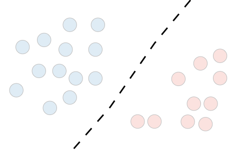
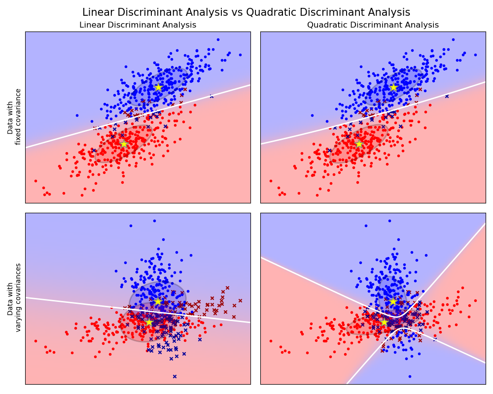

# Generative Models

There are two types of supervised learning algorithms in Machine Learning:

* Discriminative Learning Algorithms
* Generative Learning Algorithms

Discriminative learning algorithms try to find a decision boundary between different classes during the learning process. Examples include `Logistic Regression`, `Linear Regression`, and `SVM`. Such models try to model $P(y|X)$.

On the other hand, generative learning algorithms try to capture the distribution of each class separately instead of finding a decision boundary among classes. Examples include `Gaussian Discriminant Analysis` and `Naive Bayes`. Such models try to model $P(X|y)$ for a given $P(y)$, where $P(y)$ is known as a class prior.

| |**Discriminative Model**| **Generative Model**|
|- | - | - |
|**Goal**| Directly estimate $P(y\ given\ X)$|Estimate $P(X\ given\ y)$ then deduce $P(y\ given\ X)$|
|**What's learned**|Decision boundary|Probability distributions of the data|
|**Illustration**|||
|**Examples**| Regression, SVMs|GDA, Naive Bayes|

[Table source](https://stanford.edu/~shervine/teaching/cs-229/cheatsheet-supervised-learning)

The predictions for generative learning algorithms are based on `Bayes Theorem`:

$$
\begin{aligned}
P(y|X) = \frac{P(X|y)P(y)}{P(X)}
\end{aligned}
$$

where:

* $P(y)$ - prior probability
* $P(X|y=k)$ - likelihood
* $P(X)$ - evidence

Comparison between discriminative and generative models:

* Discriminative models are computationally cheaper.
* Generative models have more impact on outliers.
* Generative models can work with missing data while discriminative models cannot.
* Generative models are less accurate when the assumptions are violated.

Example 1: Gaussian Discriminant Analysis

Gaussian Discriminant Analysis is a generative learning algorithm. In order to capture the distribution of each class, it tries to fit a Gaussian Distribution to each class of the data separately. The examples of GDA include `LDA` and `QDA`.

Linear Discriminant Analysis(LDA): binary situation

* Y ~ Bernouli($\phi$) 
* $X|y=0$ ~ $\mathcal{N}(\mu_0, \Sigma_0)$
* $X|y=1$ ~ $\mathcal{N}(\mu_1, \Sigma_1)$
* $\Sigma_0 = \Sigma_1$
  
The PDF functions:

$$
\begin{aligned}
P(y) = \phi^y(1-\phi)^{1-y} \\
P(X|y=0) = \frac{1}{\sqrt{(2\pi)^d|\Sigma_0|}}exp(-\frac{1}{2}(X - \mu_0)^T\Sigma_0^{-1}(X - \mu_0))\\
P(X|y=1) = \frac{1}{\sqrt{(2\pi)^d|\Sigma_1|}}exp(-\frac{1}{2}(X - \mu_1)^T\Sigma_1^{-1}(X - \mu_1))
\end{aligned}
$$

Given data $D = \{(X_i, y_i), i=1,2,...,n\}$, we want to maximize the likelihood:
$$
\begin{aligned}
P(data) = P(X, y) = \prod_{i=1}^{n}P(X=X_i, y=y_i) = \prod_{i=1}^{n}P(X=X_i | y=y_i)P(y=y_i)
\end{aligned}
$$

Equivalently, we maximize the log likelihood:

$$
\begin{aligned}
log(L(\phi, \mu_0, \mu_1, \Sigma)) = \sum_{i=1}^{n}(logP(X=X_i|y=y_i) + logP(y=y_i))
\end{aligned}
$$

The solutions to the function above are as follows:

* $\hat{\phi} = \frac{1}{n}\sum 1(y_i=1)$
* $\hat{\mu_0} = \frac{\sum 1(y_i=0)X_i}{\sum 1(y_i=0)}$
* $\hat{\mu_1} = \frac{\sum 1(y_i=1)X_i}{\sum 1(y_i=1)}$
* $\hat{\Sigma} = \frac{1}{n-2}\sum(X_i - \mu_{y_i})(X_i - \mu_{y_i})^T$

The significant difference between LDA and QDA is that we apply LDA when a linear separation occurs between the classes. In contrast, when there is a non-linear separation between the classifiers, we use QDA.

[Image source](https://scikit-learn.org/stable/_images/sphx_glr_plot_lda_qda_001.png)

Example 2: Naive Bayes

Naive Bayes algorithm is one of the simple and fast classification algorithms which helps in building fast machine learning models that can make quick predictions. It is a probabilistic classifier, which means it predicts on the basis of the probability of an object. Some popular examples of Naive Bayes algorithm include spam filteration and sentiment analysis.

**Naive**: It is called Naive because it assumes that the occurrence of a certain feature is independent of the occurrence of other features.

**Bayes**: It is called Bayes because it depends on the principle of Bayes' Theorem.

Let's assume we have dataset $D=\{(x_i, y_i), i=1,2,...,n\}$, we apply Naive Bayes algorithm in the following way:

$$
\begin{aligned}
p(y|X) = \frac{p(X|y)p(y)}{p(X)}
\end{aligned}
$$

Where $y$ is class variable and $X$ is dependent feature vector. With the naive assumption, the probability function could be rewritten as:

$$
\begin{aligned}
p(y|x_1, x_2, ..., x_n) = \frac{p(x_1|y)p(x_2|y)p(x_3|y)...p(x_n|y)p(y)}{p(x_1)p(x_2)p(x_3)...p(x_n)}
\\
p\left(y \mid x_1, \ldots, x_n\right) \propto p(y) \prod_{i=1}^n p\left(x_i \mid y\right)
\end{aligned}
$$

Then our objective function becomes:

$$
\begin{aligned}
y=\operatorname{argmax}_y p(y) \prod_{i=1}^n p\left(x_i \mid y\right)
\end{aligned}
$$

Pros of Naive Bayes:

* One of the fast and easy ML algorithms to predict a class of datasets.
* Can be used for binary as well as multi-class classifications.
* Performs well on multi-class predictions compared to other algorithms.
* The most popular choice for text classification problems.

Cons of Naive Bayes:

* Assumes that all features are independent.

Usecases:

* Credit scoring
* Medical data classification
* Real-time predictions
* Spam filtering and sentiment analysis